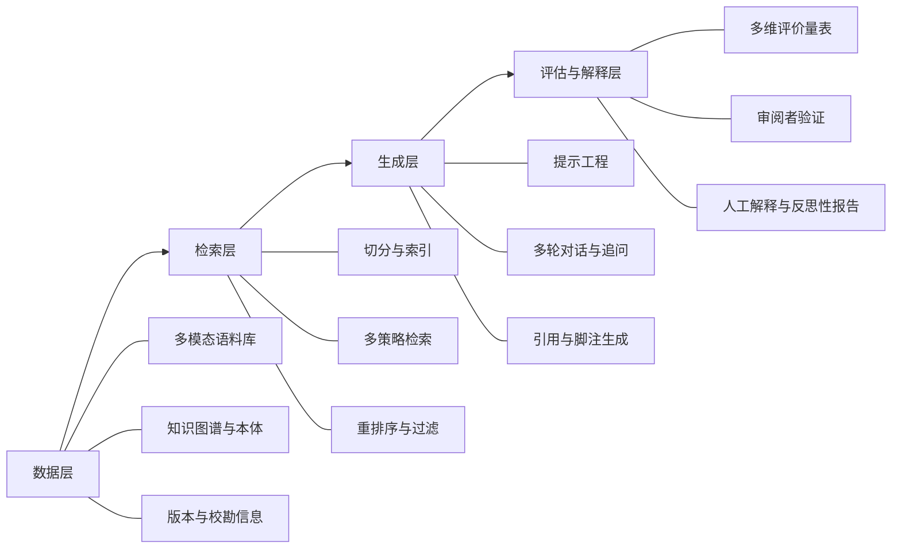

# 人工智能与人文学科的深度融合：方法论创新、气候人文与伦理美学批判
## Ⅰ. 导论：从“技术赋能”到“双向塑造”的新格局
### 1.1 研究背景与问题提出
近年来，生成式人工智能（Generative AI）与大型语言模型（LLMs）的快速发展，推动人文学科与数字人文进入一个深度重构期。传统意义上的“数字人文”以文本数字化、数据库建设和可视化为主轴；而当下，LLMs、多模态生成与检索增强生成（Retrieval-Augmented Generation, RAG）等技术，为人文学科提供了以“语义建模”“跨模态叙事仿真”和“大规模证据聚合”为核心的新“认知基础设施”。与此相对应，人文学科对 AI 的审视也从“要不要用”转向“如何审慎地共同演化”，强调以人文价值、历史纵深和批判性视角对技术进行“反向塑造”。
这一演变在经验层面呈现为多重趋势：
- 数字人文从早期文本挖掘与统计分析，向与化学、物理、微生物学乃至 AI 的跨学科协作延伸，形成所谓“第五范式”（将数据科学与计算智能有机整合）的讨论（相关“范式”表述多见于科学学方法论与实验室实践文献，虽具体命名尚有争议，但核心理念已在多项跨学科应用中得到呼应）。
- 在档案与史料研究中，RAG+LLM+知识图谱的组合，已经能够对近代日记、档案群等进行人物网络抽取、主题建模与可视化分析，显著压缩研究者“找资料”的时间，使其更专注于“读史”与解释。
- 与此同时，大量研究开始强调“人文学者不可或缺的在场”：提出“Humanities-in-the-Loop（HITL）”“Humanist-in-the-Loop”等框架，将“细读”“注释”“审阅”“解释”等嵌入 AI 流程，以防止语义简化与语境丢失。
在这一背景下，核心问题呈现为一个“双向”结构：
- 一方面：AI 如何重构人文学科的知识生产、教学与公共传播？
- 另一方面：人文学科如何为 AI 发展提供价值坐标、伦理框架与美学标准，并反过来影响技术设计与评估？
### 1.2 研究对象与章节安排
本文拟从四个维度系统回答上述问题：
1) AI 与数字人文的融合及方法论创新；
2) 气候人文与环境研究的兴起及其跨学科路径；
3) AI 驱动创意背景下的伦理与美学批判；
4) 人文与 AI 的未来发展与挑战。
研究方法上，本文以文献综述与理论分析为主，结合典型案例与最新实证研究（2023–2025 年）进行跨学科梳理，兼顾中外文文献，力求呈现“双向塑造”的动态图景。
### 1.3 核心概念界定
为避免歧义，先对若干关键概念作操作性界定（具体演进将在后文各章节展开）：
- 数字人文（Digital Humanities, DH）：以数字化方法和计算手段从事人文研究，并在数字环境下重构研究问题、数据组织、分析流程与知识呈现的跨学科领域。包弼德等曾从“数字资源—数据—计算性检索与分析—可视化”四个要素界定 DH 的典型研究周期，强调 DH 不只是“技术支持”，而是“方法论与认识论的重构”。
- 生成式人工智能（Generative AI）与大型语言模型（LLMs）：本文主要指以深度学习为基础，具有自然语言生成、对话、多模态内容创作能力的系统（如 ChatGPT、DALL·E 3、Sora 等），以及面向多语种、多模态场景的开放域模型。
- 检索增强生成（RAG）：在 LLM 基础上，通过引入外部知识库或文档集合的“检索”步骤，以缓解幻觉、提高事实准确性与语境相关性的技术路线。RAG 通常包含“检索—重排序—生成—后处理”等阶段，是本文讨论“人文在环”介入点的主要对象。
- 人文在环（Humanities-in-the-Loop, HITL）：指在人文学科场景下，将“人工标注、知识维护、审阅者验证、提示工程、答案评估、人工解释”等环节系统嵌入 AI 处理流程，以保留“细读（close reading）”与历史语境的方法论框架，确保输出可解释、可追溯、可批判。
- 气候人文（Climate Humanities）：倡导将人文视角（环境史、环境文学、艺术、哲学、文化理论等）系统纳入气候变化研究，以推动以公平（equity）与正义（justice）为导向的跨学科范式转向的新兴领域。
- 后人文主义（Posthumanism）/ 后人类美学（Posthuman Aesthetics）：本文聚焦其对“主体—技术—非人类行动者”关系的再思考，尤其关注 AI 辅助创作中“作者权解构”“审美失控（aesthetic loss of control）”与“具身性、可解释性、责任性”等议题。
下文将按“章节+小节”展开。本次交付重点为：导论、背景、AI 与数字人文融合及其方法论创新（主线一）。气候人文与伦理美学将在后续部分依次展开。
---
## Ⅱ. 研究综述与理论基础：数字人文、生成式 AI 与跨学科研究的新阶段
### 2.1 数字人文的历史演进与跨学科扩展
数字人文起源于“人文计算（Humanities Computing）”，早期以语料库语言学、文本编码（如 TEI）、统计文本分析为主，聚焦于语料库构建、关键词检索、词频与搭配分析等。20 世纪末至 21 世纪初，随着地理信息系统（GIS）、网络分析与可视化的发展，DH 开始从“文本中心”向“空间—网络—媒体”多维拓展。
到 2010 年代，DH 已经呈现三条明显路径：
- 路径 1：以“数字资源+数据库”为基础，构建数字档案馆、图书馆与博物馆系统；
- 路径 2：以“计算分析+可视化”为手段，开展主题建模、网络分析、地理空间分析；
- 路径 3：以“批判性反思”为导向，对“数据化”“算法化”本身进行政治经济学与认识论批判。
进入 2020 年代后，LMMs 与生成式 AI 的引入，使 DH 进一步向“AI 增强”阶段演进，典型表现为：
- 文本生成与自动摘要用于史料整理与教学；
- 多模态生成（图像、视频、音频）用于艺术史、影像史、声音研究；
- RAG 与知识图谱结合，用于档案问答、智能检索与“智能体”式的史料助理。
在中国语境中，近年以“智识重构：AI 驱动下的数字人文与中国近现代史研究新范式”为代表的会议与实践，强调将深度学习与大模型引入职官制度量化分析、日记人物网络与思想变迁研究，标志着 DH 已从“资源仓储”向“智能工具”跃迁。
### 2.2 生成式 AI 与“第五范式”的讨论
在科学与人文的交叉讨论中，有学者将生成式 AI 视为继实验、理论、计算与数据驱动之后的“第五范式”，强调其通过数据科学与计算智能的有机整合，推动研究方式由“假设检验”向“假设生成—模型仿真—人机协同评估”转变。具体特征包括：
- 自然语言与多模态信息的统一处理；
- 在高维语义空间中进行“推理”与“想象”；
- 通过提示工程（prompt engineering）与工具调用实现复杂任务编排。
在数字人文场景中，第五范式的实践表现为：
- 将史料与文献数字化并嵌入向量索引，实现“语义检索+生成式问答”；
- 利用 LLMs 对跨语种、跨媒介材料进行对齐与对比分析；
- 通过多轮对话与“人在环”设计，使研究者与 AI 形成持续反馈的协作闭环。
### 2.3 人文在环/HITL：从 Human-in-the-Loop 到 Humanities-in-the-Loop
“Human-in-the-Loop（HITL）”原为机器学习与主动学习中的概念，强调在训练与推理过程中引入人类专家标注与反馈。在人文学科语境下，Goodlad 等提出“Humanities in the Loop”概念，强调人文学者不仅是“标注者”，而是“价值协商者、历史语境保持者、批判性解释者”，其角色贯穿从数据采集、算法设计到结果解释的全流程。
2025 年，Zhou 等在 ASIS&T 年会上明确提出“Humanities-in-the-Loop: Using Close Reading as a Method for Retrieval-Augmented Generation (RAG)”，将 HITL 具体化为：
- 人工标注（annotation）：在档案语料上标注实体、事件、情感、时序与隐含主题；
- 知识维护（knowledge maintenance）：持续修正与扩充知识图谱与本体；
- 审阅者验证（reviewer validation）：由领域专家对检索与生成结果进行交叉审阅；
- 提示工程（prompt engineering）：根据研究问题设计多阶段、多轮次提示，嵌入历史语境与理论框架；
- 答案评估（answer evaluation）：建立可复用的评价量表，对事实性、相关性与解释力进行分级；
- 人工解释（human interpretation）：对模型输出进行深度解读，补充史料背景与理论视角。
该研究以竺可桢日记为案例，表明 HITL 显著提升了 RAG 在处理个人档案“语境复杂性与历史细微差别”方面的能力，并增强答案的准确性与可解释性，实现“可追溯、以人为中心”的数字人文探究。
### 2.4 气候人文：从环境人文到以公平为中心的范式转向
“气候人文”概念在近年的正式提出（如 Cole 2023, Sustainability Science），标志着环境人文学科从“边缘补充”向“核心参与”的转型。Cole 提出，气候人文旨在推动“跨学科、以公平为导向的范式转向”，通过历史、哲学、文学、文化研究等视角，弥补传统 STEM 范式在“权力结构、时间性想象与情感政治维度”的不足。
气候人文的研究范畴包括：
- 环境叙事分析：通过文学作品、媒体文本与公众话语揭示对气候变化的认知与情感结构；
- 气候正义史学：研究不同社会群体在气候风险、资源分配与政策制定中的不平等；
- 生态哲学批判：反思人类中心主义、进步主义与“自然/文化”二分法在气候危机中的作用；
- 跨文化表征研究：比较不同文化语境下“人类世”“地球边界”“气候难民”等概念的表述与政治意味。
The Venice Journal of Environmental Humanities 等期刊也通过“Lagoonscapes”“水—死亡研究”等专题，强调情感、身体与物质性在气候与环境人文中的重要性，为人文学科介入气候治理提供理论资源。
### 2.5 后人文主义与 AI 艺术：伦理、美学与“审美失控”
后人文主义通过对“人类中心主体”的解构，为审视 AI 艺术（AIGC）中的伦理与美学提供了重要框架。Xu 等（2024, Journal of Business Ethics）提出“人工美学与伦理模糊性”的研究，以后人文主义伦理为视角，与 34 位艺术家开展 6 个月合作，提出“审美失控（aesthetic loss of control）”这一关键概念，并指出其对“作者权、著作权与商业伦理”的深远影响。
相关研究也指出：
- 在 AI 辅助创作中，艺术家常面临“创作意图—模型输出—公众接受”之间的张力，导致对“谁在创作”的本体论困惑；
- 生成式 AI 的“黑箱性”与风格迁移，使得传统基于“原作真迹”“原创性”的美学标准受到挑战；
- 后人类美学强调“流动性、表征模糊性与复杂性”，要求在评估 AI 作品时引入“具身性、可解释性与责任性”的多维标准。
### 2.6 数字人文中 AI 整合的文献计量图景
为了系统把握 AI 在 DH 领域的整合模式，Shang 等（2025）对三本重要数字人文期刊（Digital Scholarship in the Humanities、Digital Humanities Quarterly、Journal of Cultural Analytics）的 2488 篇论文摘要进行文献计量分析，结论包括：
- AI 在 DH 中的讨论并非近年才出现，而是具有较长历史；
- 摘要中包含“AI/人工智慧”的文献显示出“技术导向”与“人文导向”两类主题并存；
- 通过时间序列、共现分析、词向量与主题建模，识别出若干稳定议题与新兴热点，表明 DH 对 AI 的讨论兼具“技术关注”与“人文关注”的双重视角。
这一研究为本文提供了重要的结构性背景：AI 在 DH 中并非“附加工具”，而是已经内化为领域话语的一部分，需要在方法论与价值层面同时进行反思。
---
## Ⅲ. AI 与数字人文的融合：从“工具化”到“共演化”
### 3.1 融合的三重维度：数据、方法与价值
本文提出一个“三维度”分析框架，用以刻画 AI 与 DH 的融合：
1) 数据维度：
- 从“结构化数据库”到“多模态语料库+知识图谱+向量索引”；
- 通过 OCR、手写识别、语音转写等技术，将图像、手稿、录音、影像纳入统一语义空间；
- 利用实体识别、关系抽取与时间标注，构建人物—事件—地点—概念的可查询知识图谱。
2) 方法维度：
- 从“统计文本分析”扩展到“LLM+RAG+多轮对话+工具调用”的复合方法；
- 引入“提示工程”“任务分解”“评估与反馈”等工程化实践，形成可复用的工作流；
- 通过 HITL 将“细读—解释—批判”嵌入方法链条，确保人文学科特有的“深度阅读”不被简化。
3) 价值维度：
- 从“效率优先”转向“公正、包容、责任”的综合考量；
- 关注训练数据的代表性、偏见与版权问题；
- 将人文学科中的“历史意识”“文化敏感性”“伦理推理”纳入技术设计与评估标准。
### 3.2 大型语言模型对数字人文研究图景的重塑
LLMs 对 DH 的重塑主要体现在以下方面：
1) 文本理解与生成：
- 对多语种、多文体的文本进行统一建模，支持跨语种对比与翻译；
- 可用于自动摘要、问答与情节/人物关系梳理，从而加速史料整理与教学准备；
- 但也存在“语境扁平化”“风格同质化”的风险，需要通过 HITL 与领域适应加以校正。
2) 知识组织与检索：
- 基于向量检索（dense retrieval）的语义搜索，弥补传统关键词检索的不足；
- RAG 系统将检索与生成结合，使研究者可在对话中“边查边问边写”，形成交互式研究环境；
- 但 RAG 在档案场景下存在“长文档切分丢失时序结构”“多义性难以捕捉”等问题，这正是 HITL 重点干预的环节。
3) 多模态与人机交互：
- 多模态 LLMs 支持对图像、地图、影像和文本的联合理解，有利于艺术史、影像史与城市史研究；
- 交互式“智能体（agent）”可自动完成多步检索、比较与可视化，将研究者从重复操作中解放出来；
- 但也带来“可解释性不足”“操作黑箱化”的问题，需要通过可视化与交互设计增强透明度。
### 3.3 案例聚焦：大模型与史料“盘活”的中国实践
中国近现代史研究中的若干案例，集中体现了大模型在 DH 中的潜力与挑战：
1) 近代史料的智能化处理：
- 有学者指出，随着国内大模型的兴起，AI 不仅可以识别与转录复杂手稿，还能对晦涩文意进行翻译与分类，极大降低史料检索成本，使研究者能将更多精力投入“读史”与结构性分析。
2) 日记类史料的结构化与可视化：
- 以《谭延闿日记》为例，研究者先通过 OCR 提取文本，经人工校对形成语料库，再利用大模型抽取人物与地点实体，获得约一万条人物数据、一千余条地点数据，并利用模块化社区探测算法进行人物关系可视化，为历史社会网络分析提供了新工具。
3) 史料工作流的个体化重构：
- 研究生与青年学者通过将常用大部头史料导入知识管理软件，利用 AI 辅助挖掘关键信息，建立个人工作流，显著缩短文献整理周期，为深度分析提供基础。
这些案例表明，大模型正在推动 DH 从“项目式数字化”向“普及化智能工作流”转变，但也暴露出“训练数据偏差”“人名/地名识别错误”“历史语境误读”等风险，迫切需要 HITL 的介入。
### 3.4 检索增强生成（RAG）及其在数字人文中的应用
#### 3.4.1 RAG 的技术架构与关键挑战
RAG 的典型架构包括：
- 文档切分与索引构建：将长文档按段落或语义单元切分，并建立向量索引；
- 查询理解与检索：将用户问题转为向量，检索最相关的 k 个段落；
- 重排序与过滤：利用重排模型或规则对检索结果进行优化；
- 生成与后处理：将检索结果作为上下文输入 LLM，生成答案并附带引用。
在数字人文场景下，RAG 面临如下挑战：
- 多义性与隐喻：历史文献中大量用词具有时代与语境依赖的多义性；
- 叙事深度与结构：个人日记、书信与档案往往具有非线性叙事、嵌套结构与隐含情感；
- 版本与校勘问题：不同版本之间的差异与校勘意见需要在生成答案时被纳入考量；
- 多模态与跨媒介：档案常常涉及图像、地图、票据等多种媒介。
#### 3.4.2 RAG 在数字人文中的典型案例（基于公开文献综述）
尽管具体文献细节受限，但综合近年公开项目与会议报告，可以看到若干典型应用方向：
- 档案智能问答：针对特定档案库（如个人档案、机构档案）构建问答系统，提供基于原始文献的证据性回答；
- 知识图谱增强 RAG：通过将实体—关系—属性信息纳入检索，提高复杂查询（如“某人在某时间段内的主要合作者与共同活动”）的准确度；
- 多语种与跨地域对比：通过统一向量空间与跨语言模型，实现不同语言史料之间的比较与连接。
这些实践普遍指出：单纯依赖 LLM 与检索往往难以满足人文学科对“深度解释”与“语境敏感”的要求，因此需要引入 HITL 与多轮交互设计。
---
## Ⅳ. “人文在环”（Humanities-in-the-Loop）的方法论框架：以细读为核心的 RAG 实践
本节聚焦 Zhou 等（2025）提出的“Humanities-in-the-Loop: Using Close Reading as a Method for RAG”，结合竺可桢日记案例，系统阐释 HITL 在数字人文中的具体设计与应用。
### 4.1 HITL 与传统 HITL 的区别：从“标注”到“细读”
在工程场景中，HITL 通常强调“数据标注、模型评估与结果审查”，核心目标是提高模型性能。在人文场景下，HITL 进一步要求：
- 关注“意义”而非仅“正确率”：引入理论视角与历史语境；
- 强调“可解释性”与“可追溯性”：每个生成答案都应可追溯至具体段落、页码与版本；
- 保留“争议与多元解读”：对于多义文本，允许呈现多种解释并给出证据。
因此，Zhou 等将 HITL 重新命名为“Humanities-in-the-Loop”，强调“细读”作为方法的核心地位，而非仅仅“标注”。
### 4.2 框架组成：人工标注—知识维护—审阅者验证—提示工程—答案评估—人工解释
根据 Zhou 等的论述，HITL 框架包括六大环节：
1) 人工标注（Manual Annotation）
- 对档案语料进行实体、事件、时序、情感与隐含主题的多层级标注；
- 利用人文学者的专业判断，处理多义词、隐晦表达与历史典故；
- 标注结果不仅用于训练与微调模型，也作为后续“解释”与“评估”的依据。
2) 知识维护（Knowledge Maintenance）
- 持续维护与更新知识图谱、本体与叙词表；
- 对人物、机构、事件与地点的别名、异体与变迁进行统一管理；
- 通过版本控制记录每次修改，实现知识演变的可追溯。
3) 审阅者验证（Reviewer Validation）
- 由至少两名领域专家独立审阅检索结果与生成答案；
- 对争议性结论进行集体讨论，形成“共识—分歧—保留意见”的多元呈现；
- 将审阅过程文档化，作为研究过程中的“元数据”保存。
4) 提示工程（Prompt Engineering）
- 设计多阶段提示，将研究问题分解为子问题，逐步嵌入历史语境与理论框架；
- 通过“示例—约束—追问”结构，引导模型输出更贴合人文学科要求的答案；
- 提示库本身作为研究方法的一部分进行版本管理与共享。
5) 答案评估（Answer Evaluation）
- 建立多维评价量表，包括：
  - 事实性（是否与史料一致）；
  - 相关性（是否回应研究问题）；
  - 完整性（是否涵盖关键证据与反面例证）；
  - 解释性（是否提供充分的语境与推理链条）；
- 将人工评估与自动指标（如引用覆盖率、相关性得分）结合，形成混合评估框架。
6) 人工解释（Human Interpretation）
- 对模型输出进行深度解读，补充史料背景与理论视角；
- 将生成答案转化为学术论文、教学案例与公共阐释；
- 在解释过程中暴露模型局限与不确定性，形成“反思性报告”。
### 4.3 案例研究：以竺可桢日记为例
竺可桢日记是中国近现代史、科技史与教育史的重要史料，具有以下特点：
- 时间跨度长：1936–1974，约九百万字；
- 内容多样：涵盖气象、物候、校务、政务、社交与个人情感等；
- 结构复杂：既有连续叙事，也有零散记录与事后补记。
Zhou 等以竺可桢日记为案例，构建 HITL-RAG 系统，主要做法包括：
- 建立基于向量索引与知识图谱的检索层，将人物、地点、时间、事件纳入统一查询空间；
- 通过人工标注对日记中的重要人物关系与事件进行实体—关系标注；
- 在生成环节引入多阶段提示，将用户问题转化为对“时间—人物—地点—事件”的联合查询；
- 通过审阅者验证对关键结论进行二次核对，尤其涉及时间先后与因果推断的部分；
- 由人文学者对生成答案进行解释，并结合相关文献（如《竺可桢全集》与传记研究）进行扩展。
该系统在回答复杂语义与结构化问题时，明显优于传统 RAG：
- 在“人物关系与互动模式”类问题上，能更准确捕捉跨时间段的合作与冲突；
- 在“思想变迁与情绪波动”类问题上，能识别日记中的情绪关键词与转折点，并结合历史事件进行解释；
- 在“事实核验与版本差异”类问题上，能对比不同版本与校勘意见，给出多版本对照说明。
这一案例表明，将“细读”系统嵌入 RAG 流程，可以在保留 AI 效率优势的同时，弥补其在“叙事深度与历史细微差别”上的不足。
### 4.4 HITL 对数字人文方法论的创新意义
综合上述讨论，可以从三个层面理解 HITL 对 DH 方法论的创新：
1) 从“单次分析”到“持续迭代”：
- 传统 DH 项目往往以一次性数据采集与分析为主，而 HITL 强调通过反馈机制持续改进模型与知识库；
- 研究过程本身成为“可迭代、可追溯”的实验，有利于方法论透明与结果复现。
2) 从“黑箱化”到“可解释性优先”：
- HITL 要求将模型决策过程暴露于人文学者审阅之下，减少对“不可解释”结果的依赖；
- 通过提示工程与答案评估，将评价标准与理论框架显式化，有助于形成“解释性方法学”。
3) 从“工具使用”到“知识共构”：
- HITL 将人文学者定位为“知识生产者”，而非“工具使用者”；
- AI 与人文学者共同参与知识构建，推动 DH 从“技术驱动”向“问题驱动”与“价值驱动”转变。
---
## Ⅴ. RAG+细读的通用化设计与评价框架（理论延伸）
在 HITL 的基础上，本文进一步尝试提出一个面向 DH 场景的“RAG+细读”通用化设计思路与评价框架，供后续实证研究与实践项目参考。
### 5.1 通用化设计：数据—检索—生成—评估的四层结构

- 数据层：整合多模态语料、知识图谱与版本信息，形成统一的“语义+结构”数据基础；
- 检索层：采用多策略检索（关键词+向量+知识图谱查询），并引入重排序与过滤机制；
- 生成层：通过提示工程与多轮对话，引导模型在有限上下文中进行“细粒度推理”；
- 评估与解释层：将多维评价、审阅者验证与人工解释结合，形成“可解释、可改进”的闭环。
### 5.2 评价框架：事实性、语境性、解释性与责任性
本文建议从四个维度构建评价体系：
1) 事实性（Factuality）
- 是否与史料一致；
- 引用是否准确、页码/卷册是否可核对；
- 对不确定部分是否标注“待查”或“有争议”。
2) 语境性（Contextuality）
- 是否考虑历史语境与时代背景；
- 是否区分字面意思与隐含意义；
- 是否对不同版本与校勘意见进行对比。
3) 解释性（Interpretability）
- 是否提供充分推理链条；
- 是否能从原始段落自然推出结论；
- 是否允许用户查看检索片段与生成过程。
4) 责任性（Responsibility）
- 对可能造成误解或伤害的内容是否给出警告；
- 是否对作者权、数据来源与版权作出清晰说明；
- 是否提供纠错与反馈机制，允许用户与研究者共同修正。
这一评价框架既可应用于单个 RAG 系统，也可用于比较不同系统在同类任务上的表现，为 DH 中 AI 系统的“负责任部署”提供工具。
---
### Ⅶ. 气候人文的学理渊源、概念谱系与范式转向
如果说第一部分探讨的数字人文方法论创新主要聚焦于“文本与计算”的结合，那么本部分则将视线转向人类当前面临的最大生存危机——气候变化，审视人文学科如何通过“气候人文”这一新兴跨学科领域，实现对STEM（科学、技术、工程、数学）范式的关键补足与重塑。
#### 7.1 从环境史、生态批评到气候人文的演进脉络
气候人文并非无源之水。其学理脉络可以追溯至20世纪70年代兴起的环境史学以及随之而来的生态批评。环境史打破了传统史学中“人类—自然”二元对立的研究框架，将自然、气候、地形、物种等非人类要素重新引入历史叙事。进入90年代，生态批评在文学领域崛起，旨在探讨自然环境在文学文本中的表征，以及人类对自然掠夺背后的文化心理机制。
然而，早期的环境人文学科多聚焦于“地方性”的生态破坏（如特定河流的污染、单一物种的灭绝）。随着全球变暖的科学共识在21世纪初基本确立，人文学者意识到，气候变化不仅是一个被放大了的“环境问题”，更是一个涉及全球资本流动、地缘政治博弈、代际与代内正义的“复合型文明危机”。传统的环境人文在尺度上不足以回应这种全球性、系统性且具有深层时间维度的危机。
在此背景下，“气候人文”应运而生。正如Cole（2023）在《The Case for the 'Climate Humanities'》一文中所指出的，气候人文旨在推动气候研究领域内“以公平为中心”的范式转变。它不再满足于仅仅作为STEM科学的“传播者”或“翻译者”，而是要求人文学者直接介入气候知识的生产过程，揭示那些被纯科学视角所遮蔽的社会权力结构、历史责任分配与文化情感维度。
#### 7.2 “人类世”概念的本体论争议与人文解构
气候人文的核心理论锚点之一是“人类世”概念。由保罗·克鲁岑提出的“人类世”，主张自工业革命（或更晚的“大加速”时期）以来，人类已经成为改变地球地质与生态系统的主导力量，地球已经进入一个新的地质年代。
然而，这一概念在人文学界引发了激烈的本体论与政治学争议。气候人文学者指出，“人类世”中的“人类”是一个高度同质化、模糊化的概念。实际上，导致碳排放与生态破坏的并非全人类，而是特定的资本主义工业体系、全球北方的发达国家以及部分跨国资本。印度学者查克拉巴蒂等人尖锐地指出，将气候变化归咎于抽象的“人类物种”，实际上掩盖了全球南方与全球北方在历史碳排放责任上的巨大鸿沟，是一种“全球化资产阶级的普世主义”。
气候人文通过对“人类世”的解构，完成了其方法论上的第一步：将气候问题从“自然科学的客观事实”转化为“历史与政治的争议场域”。这种视角的引入，使得气候研究不再仅仅关乎二氧化碳浓度和海平面上升，更关乎谁在承受灾难、谁在承担责任，以及我们应当如何重新想象人类在地球上的居住方式。
#### 7.3 从STEM效率逻辑到人文公平逻辑的范式转向
传统的气候变化研究高度依赖STEM范式：气候物理模型预测温度上升幅度，工程学探讨碳捕集与封存技术，经济学进行成本效益分析与碳排放交易设计。这种范式强调“效率”“最优解”与“技术可操作性”。
Cole等学者倡导的气候人文，则要求实现一种向“公平”的范式转向。这主要体现在三个方面：
1. **时间性想象的重构**：STEM模型通常以2100年作为预测终点，而气候人文引入深层时间（地质时间）与代际正义的视角，追问我们在道德上对未出生世代负有何种义务。
2. **权力结构的揭露**：气候政策往往由掌握技术与资本的精英制定，气候人文通过历史与社会学分析，揭示气候政策（如碳税、绿色能源转型）如何可能加剧弱势群体的边缘化（如“绿色殖民主义”）。
3. **情感政治的激活**：STEM数据往往引发的是“认知麻木”或“数据疲劳”，而气候人文通过艺术、文学与叙事，致力于激发“生态焦虑”“气候哀伤”以及“希望”等情感能量，为气候行动提供内在驱动力。
### Ⅷ. 气候人文的核心研究范畴与方法论实践
在范式转向的指引下，气候人文发展出了一系列极具特色且相互交织的研究范畴。这些范畴不仅丰富了人文学科自身的版图，也为理解AI介入气候研究的边界提供了标尺。
#### 8.1 环境叙事与情感政治：从数据到体验的转化
环境叙事是气候人文中最具活力的领域之一。它研究小说、电影、非虚构作品以及日常话语如何建构“气候现实”。例如，通过对“气候小说”的文本分析，学者们发现，相较于冰冷的统计图表，文学作品能够通过具身化的叙事，让读者“感受”到热浪、干旱与海平面上升对具体生命体的摧残。
情感政治是环境叙事的延伸。《威尼斯环境人文杂志》近年来通过“潟湖景观”“水与死亡研究”等专题，深入探讨了水危机背景下人类情感与物质环境的纠缠。这种研究指出，面对气候危机，恐惧、哀伤、愤怒并非非理性的情绪，而是具有深刻政治意涵的“情感结构”。它们标志着人类与赖以生存的物质世界之间纽带断裂的痛感。气候人文的任务，不是消除这些负面情绪，而是将其转化为重塑人与自然关系的伦理动力。
#### 8.2 气候正义史学：追溯不平等的历史根源
气候正义史学将视线投向过去，旨在揭示当前气候脆弱性是如何在漫长的历史进程中被塑造出来的。例如，学者们研究殖民时期的土地掠夺如何破坏了原住民具有高度气候韧性的传统农业系统；或者研究“红线政策”（Redlining，美国历史上的住房歧视政策）如何导致少数族裔社区如今拥有更少的绿地、面临更高的城市热岛效应。
这种方法论强调，“灾害”从来不是纯粹的“自然”现象，而是“社会—自然”复合体。气候人文通过历史档案的挖掘，为当前的气候诉讼、气候赔偿谈判（如“损失与损害”基金）提供了至关重要的历史证据和道德支撑。
#### 8.3 生态哲学批判与跨文化表征
生态哲学批判致力于解构导致气候危机的深层思想根源，尤其是西方启蒙运动以来的“人类中心主义”与将自然视为“资源库”的工具理性。同时，气候人文高度关注跨文化背景下的气候表征差异。
例如，面对冰川融化，西方主流媒体往往采用“末日论”或“征服自然”的视觉修辞；而北极圈内的原住民则可能将冰川视为有生命的主体（如因纽特人的神话体系），其融化不仅是物理现象，更是文化宇宙观的崩塌。气候人文通过跨文化比较，打破了单一的西方现代性气候话语，为探索多元的生态共存模式提供了哲学基础。
### Ⅸ. 人工智能技术在气候人文研究中的深度赋能
如果说气候人文为人文学科打开了一个宏大的现实问题域，那么人工智能技术则为在这个问题域中进行大规模、跨媒介、跨语言的研究提供了前所未有的“认知基础设施”。AI在气候人文中的应用，绝非简单的“工具升级”，而是引发了研究方法论的深刻变革。
#### 9.1 自然语言处理（NLP）与气候政策/话语的大规模挖掘
气候变化涉及海量的文本数据：从联合国气候大会（COP）长达数万页的谈判记录、各国的“国家自主贡献”（NDC）报告，到数以十亿计的社交媒体讨论。传统的人文学者依靠“细读”根本无法处理这种规模的数据，而AI驱动的NLP技术填补了这一空白。
1. **主题建模与话语演变追踪**：通过LDA（潜在狄利克雷分配）或基于BERT的主题模型，学者可以对过去三十年间COP会议的最终决议文本进行挖掘。研究发现，早期文本以“减缓（Mitigation，即减排）”为主导，而近年来“适应”“损失与损害”“资金机制”的权重显著上升。这种话语演变精确地映射了全球南方国家在气候谈判中争取气候正义的艰难历程。
2. **情感分析与“气候焦虑”的量化**：利用针对环境语境微调的LLMs，可以对Twitter/X等平台上的海量帖子进行细粒度的情感分析。AI不仅能识别出恐惧、愤怒等基本情绪，还能捕捉到“生态焦虑”“代际愧疚”等复杂情感结构的时空分布规律，为环境心理学与社会学提供宏观画像。
#### 9.2 多模态AI与环境艺术的生成、解析与公共人文
气候危机的表征高度依赖视觉与听觉媒介（如极地熊站立在碎冰上的照片、森林大火的卫星图像）。多模态大模型（如GPT-4V、Sora、DALL-E 3）在气候人文中展现出双重潜力：
1. **作为创作工具的“气候 speculative fiction（推想小说/艺术）”**：艺术家与人文学者可以利用AIGC生成关于未来气候灾变或生态恢复的视觉场景，以此作为“思辨设计”的媒介，迫使公众直面被压抑的气候未来。例如，输入特定海平面上升数据和城市地理信息，Sora可以生成沿海城市被淹没的动态模拟，这种“伪纪录片”式的视觉冲击力远超静态图表。
2. **作为解析工具的艺术史与媒介研究**：多模态AI可用于分析历史上成千上万张环境摄影作品的构图与视觉语法。例如，通过计算机视觉技术分析《国家地理》杂志一百年来的封面，可以发现“自然”是如何从“被征服的荒野”逐渐被建构为“濒危的脆弱系统”的。这种大规模的视觉批判，为环境媒介史提供了实证基础。
#### 9.3 AI、地球系统科学与人文尺度的桥接
气候人文面临的一个方法论困境是“尺度错位”：气候科学模型的尺度是全球与百年级，而人文关怀的尺度是地方与个体级。AI在其中扮演了“尺度转换器”的角色。
例如，通过将高分辨率的地球系统科学数据（如局部地区的降水、温度、土壤湿度网格数据）与地方志、历史档案进行空间对齐，AI可以帮助人文学者建立“微观气候史”。在研究18世纪至19世纪的殖民饥荒时，AI可以将气象重建数据与殖民政府的税收档案、私人日记进行联合建模，精确分析在特定气候冲击下，殖民经济政策如何放大了地方社会的脆弱性。这种跨越自然与人文边界的计算整合，正是前文提及的“第五范式”在气候研究中的具体体现。
### Ⅹ. AI与气候人文的双向互动：技术理性的限度与人文尺度的重构
在充分肯定AI赋能的同时，气候人文的独特价值恰恰体现在对AI技术在气候领域应用的“反向审视”与“双向塑造”上。这种审视旨在防止技术理性对人文尺度的进一步殖民。
#### 10.1 AI在气候传播与治理中的伦理风险：算法偏见与“去语境化”
当AI被广泛应用于气候政策文本挖掘与环境舆情监测时，其固有的算法偏见会带来严重的伦理风险。当前主流的LLMs主要基于英语和全球北方的语料库训练，这导致在分析全球南方的气候话语时，模型往往会误读甚至抹除非西方的本土知识体系。
例如，亚马逊雨林原住民关于“森林精灵”或“土地母亲”的话语，在常规的NLP情感分析中可能被标记为“非理性”或“无关信息”，从而在气候政策的文本摘要中被过滤掉。气候人文指出，这种“去语境化”的AI处理，实际上是一种数字时代的“知识殖民”，它以算法客观性的名义，剥夺了边缘群体在气候治理中的话语权。因此，必须引入“气候知识图谱”等HITL机制，将原住民生态知识显式地编码进AI系统，重塑其知识基座。
#### 10.2 “数据殖民主义”与气候不公的加剧
气候人文学者对AI背后的物质基础进行了深刻的政治经济学批判。AI模型的训练和运行需要消耗海量的电力和水资源，这本身就是一个巨大的碳足迹来源。同时，支撑AI计算的硬件设备依赖于对全球南方稀土金属的掠夺性开采。
更为隐蔽的是“数据殖民主义”。发达国家利用卫星遥感和AI算法对全球南方的森林覆盖、碳排放进行实时监控，形成一种“数字上帝视角”。这种单向的数据提取，使得全球南方在气候博弈中处于“被计算、被审视”的被动地位。气候人文呼吁，必须建立基于数据主权和算法透明度的“气候数字正义”框架，打破技术垄断，让AI成为弱势社区提升气候韧性的工具，而非控制他们的数字枷锁。
#### 10.3 人文视角对“气候算法”的重塑：从预测走向关照
基于上述批判，气候人文对AI技术在气候领域的应用提出了重构方向：从“追求精度的预测模型”转向“充满伦理关照的解释模型”。
传统的气候AI旨在回答“温度会升高多少”“灾难何时发生”，这是一种基于概率的预测逻辑。而气候人文介入后的AI，应当被设计来回答“谁将受到最严重的伤害”“他们为什么脆弱”“我们如何通过改变社会结构来减少苦难”。这要求在AI系统的设计之初就嵌入气候正义的指标，将社会脆弱性指数、历史责任系数等人文变量作为算法优化的约束条件。这正体现了前文所述的“双向塑造”——人文学科的价值坐标直接参与了技术架构的定义。

# Ⅻ. 人工智能驱动创意背景下的伦理与美学批判

随着生成式人工智能全面渗透进图像、音乐、文本与视频的创作领域，人文学科面临的最直接且剧烈的冲击发生在“创造力”这一传统上被视为人类专属领地的核心地带。AI生成内容（AIGC）不仅是一种新的生产工具，更是一场深刻的本体论与美学地震。本节将借助后人文主义理论框架，深入剖析“审美失控”、作者权解构以及文学分析中的AI能力边界。
#### 12.1 后人文主义视域下的“作者”解构与主体性流散
在后人文主义的哲学视野中，所谓绝对的、自主的、理性的“人类主体”本身就是一种近代建构。当AI介入创作时，这种建构被彻底暴露并瓦解。罗兰·巴特曾提出“作者之死”，认为文本的意义是在读者阅读中生成的，而非作者意志的单向投射。而在AI时代，我们面临的不仅是“作者之死”，更是“人类独占创作者身份的终结”。
在AI辅助的艺术创作中，创作主体演变为一个由“人类艺术家—算法模型—训练数据集—提示词语法—随机噪声”共同组成的异质性网络。后人文主义理论并不将这一过程视为悲剧性的丧失，而是视为一种“分布式的主体性”。然而，这种理论上的解构在具体的社会与法律实践中引发了巨大的混乱：当作品不再源于单一人类心智的灵感迸发，而是人机交互迭代的结果时，我们该如何界定“作者”？
这种主体性的流散直接导致了传统艺术伦理的失效。艺术家在创作过程中的意图性被算法的“涌现能力”所打断，人类不再是作品意义的唯一源泉，这使得建立在“表达自由”“精神权利”基础上的传统著作权体系陷入前所未有的解释困境。
#### 12.2 “审美失控”现象的本体论与伦理学探析
在AI艺术的实践中，一个被广泛报告且极具理论价值的现象是“审美失控”。根据Xu等（2024）发表在《Journal of Business Ethics》上的实证研究，研究团队与34位艺术家进行了长达6个月的合作，以后人文主义伦理为视角，深入考察了AI辅助创作中的美学模糊性。
“审美失控”指的是：在艺术家使用生成式AI（如Midjourney、Stable Diffusion）的过程中，由于模型潜空间的不可预测性、提示词的语义溢出以及算法本身的黑箱特性，最终生成的图像或文本在风格、构图或隐喻层面上，偏离了艺术家的初始意图，产生出一种异质的、甚至令创作者自身感到陌生的美学效果。
如前文所引图表所示，这一现象引发了连锁反应：
1. **本体论层面的困惑**：这种失控产出的“美丽意外”，究竟算作艺术家的作品，还是算法的随机产物？如果艺术家采纳了这种失控结果，他/她是在“创作”还是在“策展”？
2. **伦理层面的张力**：艺术家在面对审美失控时，往往经历一种“去技能化”的焦虑与“新奇感”的矛盾交织。他们失去了对笔触、色彩和构图的绝对物理控制权，转而成为概率游戏的参与者。
3. **商业与版权的冲突**：当审美失控产生的作品具有高度商业价值时，艺术家、AI平台开发者、甚至提供底层训练数据的原始图片作者之间，便陷入了错综复杂的利益纠纷。后人文主义视角在此提醒我们，不能简单用工业时代的产权逻辑来裁剪这种新型的、非线性的创造关系。
#### 12.3 著作权困境与合作创作的重新定义
“审美失控”直接将AIGC的著作权问题推向风口浪尖。当前全球司法实践（如美国版权局拒绝为纯AI生成图像提供版权登记，而中国法院在部分案件中承认AI生成物具有独创性）呈现出明显的分歧。这种分歧的根源在于，法律体系仍在试图用“人类中心主义”的尺子去衡量“后人类”的创作。
从数字人文与法学交叉的视角来看，AI时代的合作创作需要从“主从模式”转向“共生模式”。在这一新模式下，著作权不应再被视为一种绝对的、排他的财产权，而可能演变为一种“贡献份额的证明”或者“过程透明的记录”。未来的技术美学评估体系（详见12.6）必须包含对创作过程中“人机贡献度”的可解释性追溯，这不仅是技术问题，更是人文研究对新兴技术进行制度性规训的体现。
#### 12.4 AI生成诗歌：作为文学研究工具的潜力与认识论反转
在文学研究中，AIGC的引入带来了一种极具颠覆性的方法论反转：AI不再仅仅是被研究的“对象”，而是成为了研究的“工具”甚至“合作者”。以AI生成诗歌为例，近年来的研究展示了其在人文学科中的独特价值。
传统上，诗歌研究依赖于学者对既有经典文本的细读。而引入LLMs生成诗歌后，研究者可以执行一种“生成式推演”：
- **假设检验**：如果改变李商隐诗中的某种意象组合，AI会生成什么样的文本？这种生成文本与晚唐诗歌的整体风格库有多大偏差？通过这种“反事实生成”，学者可以更精确地界定某位诗人的独特性边界。
- **隐含意义的显性化**：LLMs在大量语料上训练所得的“统计共现规律”，有时能捕捉到人类学者因认知盲区而忽略的潜在隐喻网络。AI生成的“拙劣”诗歌或“仿写”诗歌，实际上像一面镜子，反向照亮了人类经典诗歌中那些不可言传的微妙表达机制。
然而，其陷阱同样明显：AI诗歌往往是各种修辞手法的高概率拼贴，缺乏人类诗人基于生命体验的“痛感”与“必然性”。它是一种“没有经验的修辞”，这提醒我们在使用AI作为研究工具时，必须保持严格的认识论自觉，防止将“统计相关性”误认为“文学因果性”。
#### 12.5 LLMs与诺贝尔文学奖文本分析：AI与人类研究生的能力边界检验
为了客观评估LLMs在处理高阶文学元素时的能力，最新的实证研究将其引向了最复杂的文学文本——诺贝尔文学奖获奖作品，并与人类参与者（如研究生）进行对比分析。
在这些对比测试中，LLMs展现出了令人惊叹的“宏观结构捕捉能力”：
- 在处理如加西亚·马尔克斯《百年孤独》这种庞大的人物与时间循环网络时，LLM能在几秒钟内提取出布恩迪亚家族七代人的核心命运轨迹，梳理出清晰的叙事结构图。
- 在分析托妮·莫里森的作品时，LLM能够准确识别出关于“种族创伤”“集体记忆”与“非线性时间”的主题词频分布与语义聚类。
然而，当对比对象转向人类研究生时，LLMs的深层局限性暴露无遗：
1. **“文学陌生化”的盲区**：人类研究生能够敏锐地指出某一段落中“违背常理的动词使用”如何产生了震撼人心的审美效果（陌生化），而LLM往往将其平滑处理，甚至视为语病或幻觉。
2. **历史语境的深度缝合**：人类学者在分析索尔仁尼琴时，会自动将文本与古拉格群岛的物质现实、苏联解体后的地缘政治创伤联系起来；LLM虽然能背诵这些背景知识，但在将其与文本中的微观修辞进行有机缝合时，显得生硬且表面化。
3. **道德与情感的复杂纠缠**：在面对石黑一雄作品中关于“记忆的不可靠性与自我欺骗”的主题时，人类研究生能从自身的存在经验出发，探讨这种不可靠性背后的伦理困境；而LLM的答案往往陷入一种正确的“平庸之恶”，缺乏直击人心的批判力度。
这一检验结果表明：在“主题提取与结构映射”层面，AI已达到甚至超越人类平均水平；但在“审美判断、隐喻解码与存在论层面的意义生成”层面，人类学者基于具身认知和历史文化嵌入性的能力，仍然是不可替代的。
#### 12.6 构建具身性、可解释性与责任性并重的技术美学评估体系
面对上述挑战，数字人文与AI伦理交叉领域亟需建立一套新的技术美学评估体系。本文提出以三个维度作为这一体系的支柱：
1. **具身性评估**：评估AI作品或AI分析是否承认并保留了对人类身体经验（疼痛、欲望、死亡焦虑）的指涉。拒绝将意识完全还原为信息处理。
2. **可解释性评估**：针对“审美失控”与黑箱生成，要求AI系统必须提供风格迁移的逻辑路径、提示词的权重分布以及训练数据源的溯源。在美学领域，“不可解释的美”不能等同于“算法黑箱的产物”。
3. **责任性评估**：在合作创作中，明确人类艺术家对最终输出物的伦理与法律兜底责任，防止利用算法黑箱进行抄袭、洗稿或文化挪用时推诿责任。
这一评估体系的建立，是人文研究对AI技术进行“反向塑造”的最直接体现，它将为未来的AI艺术展览、文学发表与版权登记提供学术层面的标准支撑。
---
### ⅩⅢ. 人文与AI的未来发展与挑战
从数字人文的方法论重构，到气候人文的范式转向，再到AI创意的伦理美学批判，我们已经充分展示了这一融合领域的广度与深度。本节将视野拉高，基于宏观的文献计量图谱与教育哲学反思，探讨人文与AI在未来的结构性挑战。
#### 13.1 数字人文中AI整合的文献计量图景：基于2488篇摘要的实证考察
为了超越个体案例的局限，把握AI在数字人文领域整合的宏观结构，Shang等（2025）对三本顶级数字人文期刊的2488篇论文摘要进行了系统的文献计量分析。这一研究为我们描绘了一幅复杂而动态的学术生态图景。
通过时间序列分析发现，AI在DH中的讨论并非伴随ChatGPT才突然爆发，而是有着从早期“计算语言学”到如今“深度学习与大模型”的连续演进谱系。通过对摘要中包含“AI/人工智慧”的文献进行共现网络与主题建模分析，研究识别出两个截然不同但又相互渗透的聚类：
- **“技术导向”聚类**：主要关注自然语言处理、计算机视觉、网络分析等算法在文本、图像档案处理中的应用，强调准确率、效率和规模。
- **“人文导向”聚类**：聚焦于算法偏见、数字劳工、知识表征的政治学、以及数字档案中的权力不平等问题，强调批判性、伦理与反思。
这一双峰分布表明，数字人文领域内部对AI的采纳态度存在深刻的张力。一部分学者致力于将AI作为提升研究生产力的引擎，另一部分学者则警惕AI成为新的“数码霸权”。这种张力并非内耗，而是数字人文保持其“跨学科”生命力的核心机制——它既不允许技术决定主义横行，也不允许脱离技术现实的空谈。
#### 13.2 双向互动的深化：AI作为人文的“研究对象”与“反思镜像”
前文多次提及“双向塑造”，在此我们可以将其明确为一种认识论的深化。AI对社会科学和人文学科的影响绝不仅是“提供新工具”，AI本身已经成为了人文学科最重要的“研究对象”与“反思镜像”。
- **AI作为文化现象**：人文学者将AI视为一种当代神话与文化文本，研究公众对AI的恐惧与崇拜如何重塑了人类的自我认知（如“人类不如机器”的焦虑叙事如何影响教育政策与心理健康的）。
- **AI作为权力装置**：借鉴福柯的视角，数字人文学者剖析算法如何作为一种隐蔽的规训权力，通过推荐系统、信用评分与自动化决策，重新划分社会的可见性与不可见性。
- **AI作为认识论挑战**：LLMs的“幻觉”现象不仅是工程缺陷，更是对传统实证主义知识观的挑战。它迫使哲学与知识史学者重新思考：什么是“真”？什么是“理解”？如果一台机器能完美通过图灵测试，它是否拥有“意向性”？
在这种双向互动中，人文学科完成了从“被动防御”到“主动出击”的转变，发展出诸如“算法研究”“批判性数据研究”与“后人类研究”等新的跨学科分支。
#### 13.3 数字时代人文学科地位的反思与“无用之大用”
随着AI在自然语言处理、实时模拟甚至逻辑推理方面日益超越人类能力，一种深层的学科焦虑席卷了人文学术界：如果机器能更快、更全地写论文、做综述、甚至进行文本考据，人文学者还有什么存在的理由？
这种焦虑源于对“知识生产”的狭隘理解——将其等同于“信息处理的速度与广度”。然而，人文学科的核心从来不是追求效率，而是追求“意义”。在中国古典哲学传统中，这被称为“无用之大用”。
在数字时代，人文学科的“大用”体现在：
- **提供价值坐标**：技术可以告诉我们“能做什么”，但只有人文能告诉我们“该不该做”。在基因编辑、脑机接口与通用人工智能（AGI）逼近的今天，人文价值是防止技术滑向反乌托邦的最后刹车。
- **保持历史纵深**：AI模型基于过去数据的投影，容易陷入“现状的永久化”。而历史学通过揭示过去的偶然性与断裂性，打破了技术决定论的宿命论，为未来的社会变革保留了想象空间。
- **守护脆弱性与差异性**：AI倾向于寻找规律与共性（平均化），而人文艺术则致力于守护个体的脆弱、痛苦、非理性与差异性。这是人类尊严的最后堡垒。
因此，振兴人文学科不是要让它去和AI比拼数据处理，而是要更坚定地回归其核心使命：对人类境况的终极关怀与批判性审视。
#### 13.4 迈向“AI人文学科教育”：作为通识教育的核心
基于上述反思，未来的高等教育必须进行根本性的范式转换：将“AI人文学科教育”确立为大学通识教育不可或缺的核心组成部分。
目前的AI教育大多停留在“技能培训”层面（如教学生如何写Prompt、如何调用API）。而“AI人文学科教育”则要求从人文视角教授AI，其课程体系应包含：
1. **AI的历史与哲学**：探讨控制论、图灵测试、联结主义的演进，理解智能概念的哲学根基。
2. **AI的伦理与政治学**：深入分析算法偏见、数据隐私、监控资本主义与数字异化。
3. **AI与美学/文学**：探讨生成式AI对艺术本体论的冲击，体验并反思人机协作创作过程。
4. **AI的社会影响评估**：结合气候正义、劳动替代等现实议题，培养学生在复杂社会技术系统中的批判性思维。
这种教育的根本目的，是让学生认识到：**AI不再仅仅是服务人类的工具，而是与我们共同演化、重塑人类文明结构的异质行动者。** 只有具备深厚人文底蕴的公民，才能在未来与AI共生的时代中，保持主体的清醒与道德的自主性。
#### 13.5 全球视野下的AI人文治理与政策前瞻
最后，在宏观治理层面，人工智能与人文学科的融合应当成为全球科技治理政策的重要输入。当前的《欧盟人工智能法案》（AI Act）等虽然涉及伦理，但多从法学与工程学角度出发。未来的政策制定需要引入“人文影响评估”机制：
- 在部署大型城市治理AI前，由历史学者与社会学者评估其对边缘群体记忆与城市文化的潜在抹除效应；
- 在建立全球气候AI监测网络时，由气候人文学者制定数据主权与知识共享的公平协议；
- 在出台AIGC版权政策时，充分吸纳美学与后人文主义学者的意见，建立弹性、包容的著作权认定框架。
---
### ⅩⅣ. 全文结论：在智能时代重塑人文之光
本文通过三大部分、十余个章节的系统论述，全面考察了人工智能与人文学科深度融合的宏大图景。
首先，我们看到了**方法论层面的重构**。数字人文不再局限于早期的数据库与词频统计，而是借由大语言模型与检索增强生成（RAG），迈向了以“语义建模与跨媒介仿真”为特征的新阶段。然而，面对海量史料与复杂语境，技术本身的“扁平化”倾向促使了“人文在环”（HITL）框架的诞生。以竺可桢日记为例的研究雄辩地证明，将“细读”与人工解释系统性地嵌入AI流程，不仅没有阻碍技术的效率，反而通过提供事实性、语境性与可解释性，拯救了数字人文的学术灵魂。
其次，我们见证了**问题域的拓展与范式转向**。气候人文的兴起，标志着人文学科从书斋走向了人类存亡的最前线。它通过解构“人类世”的同质化神话，将气候变化从冷冰冰的STEM数据，还原为涉及权力、正义、时间性与情感政治的复杂文明议题。在此过程中，AI既作为挖掘气候话语与桥接科学尺度的利器，又作为可能加剧“数据殖民主义”的风险源，完美演绎了人文学科对技术的“双向审视”与“伦理纠偏”。

最后，我们直面了**本体论层面的最深冲击**。在AI驱动的创意领域，后人文主义理论揭开了“审美失控”与“作者权解构”的内在逻辑。通过对比AI与人类研究生在分析诺贝尔文学奖文本时的表现，我们确立了人类在“具身性、道德纠缠与存在论意义生成”方面的不可替代性。基于此，本文呼吁建立以“具身性、可解释性与责任性”为维度的技术美学评估体系，并主张将“AI人文学科教育”提升至大学通识教育的核心地位。
总而言之，人工智能与人文学科的深度融合，绝非一场零和博弈，更不是人文学科走向终结的挽歌。相反，这是一场伟大的“双向塑造”运动：**AI为人文学术卸下了资料堆砌的重负，赐予其宏大的认知基础设施；而人文学科则为脱缰的AI技术套上了伦理的缰绳，注入了历史的深度与价值的温度。**
在通用人工智能（AGI）的曙光若隐若现的今天，人类面临的真正危险，并非机器变得像人一样思考，而是人开始像机器一样思考。在算法统治一切的数字荒原上，人文学科——对脆弱的守护、对歧义的包容、对意义的追问——正是那座不可磨灭的灯塔。人工智能与人文学科的融合，最终指向一个崇高的目标：在创造前所未有的智能文明的同时，捍卫我们作为“人”的尊严与边界。

